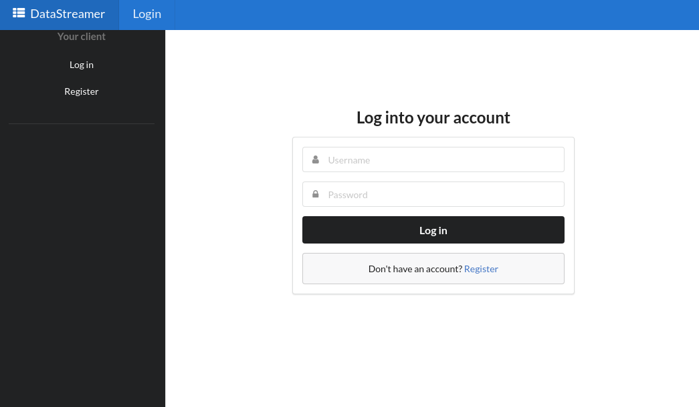
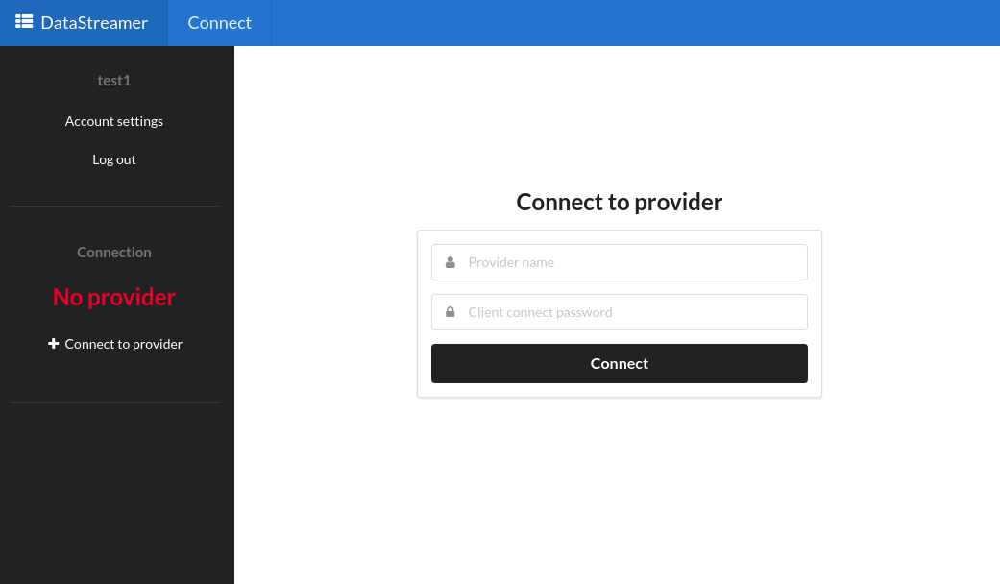
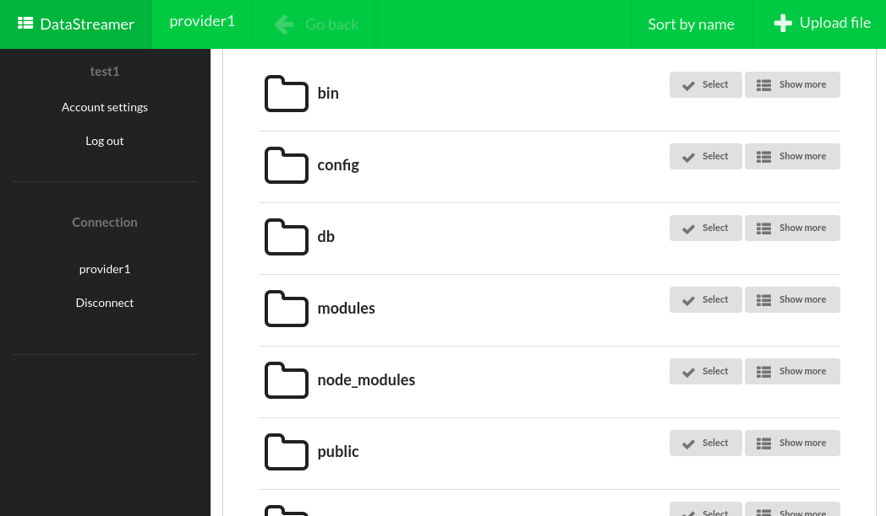

# DataStreamer-Server

Server for client and provider authentication and P2P session establishment.

Also check out [DataStreamer-Provider](https://github.com/hspasov/datastreamer-provider).

----

## About

DataStreamer-Server allows the establishment of P2P connection between provider, which gives access to files, and client, which is the remote file manager. The client is provided by the server as a web page.

Remote file management is achieved via direct peer to peer connection. But first, peers need to find each other somehow. They authenticate themselves to the server and it coordinates the information they need to send to each other in order to establish a P2P connection.

## Supported platforms

Server can be easily run in a Docker container. Check out the platforms Docker supports [here](https://docs.docker.com/install/#supported-platforms).

## Requirements

[Docker CE](https://docs.docker.com/install) and [Docker Compose](https://docs.docker.com/compose/install/#install-compose) need to be installed.

## Installation

1. Open the directory, where Dockerfile is located

```
$ cd datastreamer-server/src
```

2. Build and launch Docker application

```
$ docker-compose up --build
```

## Usage

### Launch Docker application

```
$ cd datastreamer-server/src
```

```
$ docker-compose up
```

### Remote file management

Log into a client account or create a new one



Connect to a provider by using its username and its password for client connections



Wait for connection establishment and new process creation in provider for executing client's commands. If provider is running, is connected to the server and has a selected main directory, the client shall be able to manage the files, shared by the provider.



## Documentation

This is a working product for my graduation thesis for [ELSYS](http://www.elsys-bg.org/). The full documentation can be found [here](https://github.com/hspasov/datastreamer-server/blob/master/doc/Thesis_Remote_file_management_via_P2P_connection.pdf). (in bulgarian)

## Contact

Hristo Spasov - hristo.b.spasov@gmail.com

## License

[MIT](./LICENSE)